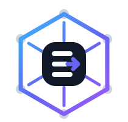
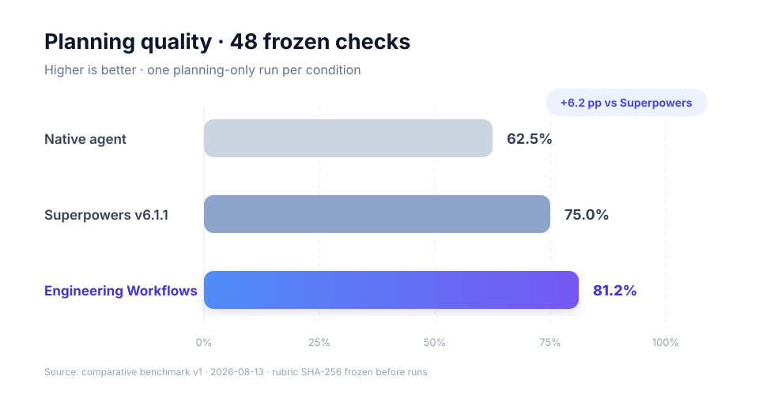
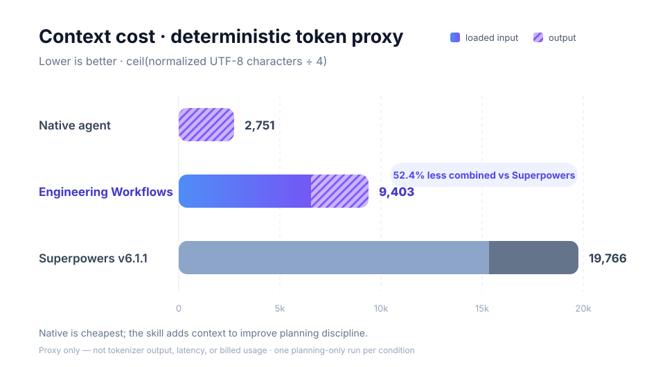

<div align="center">



# Engineering Workflows

**让 AI 编程 Agent 知道什么时候该快，什么时候必须谨慎。**

一个面向 Codex、Claude Code 等兼容 Agent Skills 工具的工程决策层：自动选择合适的工作流，
只加载当前任务需要的规则，并用可验证证据结束任务。

**简体中文** | [English](README.en.md)

[](https://agentskills.io)
[](#它如何工作)
[](#先看结果)
[](#先看结果)

[为什么需要](#ai-agent-不缺能力缺的是工程判断) ·
[测试数据](#先看结果) ·
[适合谁](#什么时候值得使用) ·
[安装](#一分钟安装) ·
[使用](#一分钟使用) ·
[完整指南](docs/usage.md)

</div>

---

## AI Agent 不缺能力，缺的是工程判断

直接使用 Agent 往往能写出代码，但它不一定知道这次任务应该采用什么工程过程：

- 一个小改动可能被过度规划，白白消耗上下文和时间；
- 一个未知崩溃可能在根因尚未证明时就被“猜测式修复”；
- 一个无法运行的测试可能被模糊地描述成验证通过；
- 一次性能优化可能没有基线、重复测量和受控变量；
- 一次只读 Review 可能越权修改代码。

Engineering Workflows 不替代 Agent 的编码能力。它补上 Agent 容易缺失的工程决策：先判断当前
目标，再选择成比例的过程，最后要求与结论匹配的证据。

> 小任务保持轻量；高风险任务获得足够严谨；无法验证时明确说 `BLOCKED`，而不是假装完成。

## 先看结果

我们没有只用描述来证明价值。仓库包含冻结任务、rubric、原始输出、来源哈希和可复现评分器。

| 条件 | 规划检查 | 加载输入代理 | 输出代理 | 综合代理 |
|---|---:|---:|---:|---:|
| Native Agent | 30/48（62.5%） | **0** | **2,751** | **2,751** |
| **Engineering Workflows** | **39/48（81.2%）** | 6,552 | 2,851 | **9,403** |
| Superpowers v6.1.1 | 36/48（75.0%） | 15,338 | 4,428 | 19,766 |





在这次冻结的 8 个 planning-only 案例中，本项目比 Superpowers 多通过 3 个检查点，同时少使用
**57.3% 加载输入代理**和 **52.4% 综合代理**。Native Agent 最便宜，因此我们的主张不是
“调用 skill 总能省 token”，而是：**当任务需要工程纪律时，用更少的流程上下文换取更好的规划。**

这里的 token 数据是 `ceil(规范化字符数 / 4)`，不是实际计费 token。每个条件只运行一次，测试
也不等同于真实编码成功率。请查看[完整对照报告](tests/evals/comparative/report.md)、
[冻结协议](tests/evals/comparative/protocol.md)和[原始结果](tests/evals/comparative/results/summary.json)。

## 为什么选择 Engineering Workflows

| | 直接使用 Agent | Engineering Workflows | 重型多 Skill 流程 |
|---|---|---|---|
| 过程选择 | 依赖当次提示和模型习惯 | **按当前目标显式路由** | 通常强制进入规定流程 |
| 上下文成本 | 最低 | **按需加载一个 workflow 与可选 strategy** | 可能连续加载多个 skill |
| 小任务 | 快，但纪律不稳定 | **保持轻量，不强制计划或 subagent** | 容易承担固定仪式成本 |
| 高风险任务 | 需要用户自己补约束 | **根因、验证和性能证据有明确门槛** | 严谨，但可能更重 |
| 混合任务 | 容易把所有活动混在一起 | **主要目标改变时才切换 workflow** | 容易形成多流程链 |
| 完成语义 | 取决于 Agent 表述 | **PASS / FAIL / BLOCKED 可审计** | 取决于各 skill 约定 |

它不是更长的通用提示词，也不是要求每次都写计划。顶层只负责路由；详细规则按需加载。Supporting
activity 不会导致无意义的 workflow 切换，计划、工件和 subagent 也只有能提高可靠性时才使用。

## 什么时候值得使用

适合显式调用：

- 未知故障、并发问题或证据不足的 Debugging；
- 跨模块开发、迁移和高风险行为变更；
- 发布门禁、验收测试和环境可能不可用的验证；
- 性能基准、回归定位和需要可复现结论的优化；
- 只读 Investigation 或 Review，以及目标可能发生切换的混合任务。

可以直接使用宿主 Agent：

- 低风险、意图清晰、验证路径显而易见的日常修改；
- 只需解释、改写或完成简单机械操作的任务。

这也是本项目采用**显式调用优先**的原因：让 workflow 的上下文成本只发生在它确实有价值时。

## 它如何工作

```text
用户目标 + 仓库约束
    -> engineering-workflow 路由
    -> 一个主要意图
    -> 一个 workflow
    -> 按需加载 scale / strategy
    -> 执行与验证
    -> 主要目标改变时再切换
```

| 意图 | 它回答的问题 |
|---|---|
| **Development** | 需要有意改变什么软件行为？ |
| **Testing** | 系统是否满足明确的验收标准？ |
| **Debugging** | 什么原因导致了意外行为？ |
| **Performance** | 性能如何、原因是什么、结论在哪些受控条件下成立？ |
| **Investigation** | 现有系统实际上如何工作？ |
| **Review** | 现有改动或设计中存在哪些问题与风险？ |

核心 skill 遵循开放的 Agent Skills 格式：一个 `SKILL.md` 入口和渐进加载的 references。
`agents/openai.yaml` 只是可选的 OpenAI 集成，其他兼容宿主可以忽略。

## 一分钟安装

Codex 仓库级安装：

```bash
mkdir -p <repo>/.agents/skills
cp -r skills/engineering-workflow <repo>/.agents/skills/
```

Claude Code 仓库级安装：

```bash
mkdir -p <repo>/.claude/skills
cp -r skills/engineering-workflow <repo>/.claude/skills/
```

只安装 `engineering-workflow`。六种 workflow 是内部 references，不是六个独立 skill。用户级路径、
Windows 命令和其他兼容宿主请参阅[完整安装指南](docs/usage.md#2-安装)。

## 一分钟使用

使用宿主对应的语法显式调用，然后正常描述目标：

```text
Codex CLI / IDE  $engineering-workflow
ChatGPT          @engineering-workflow
Claude Code      /engineering-workflow
```

```text
$engineering-workflow

LMCache 的 REGISTER_KV_CACHE 在 DCU 环境报 HIP error，
请找到根因，修复，并补充回归测试。
```

框架会先进入 Debugging；根因得到证明后转入 Development；只有当主要交付物变成独立验收结论时，
才转入 Testing。你只需要说明想得到什么，不需要自行选择 workflow、scale、artifact 或 agent 数量。

## 文档与仓库

- [完整使用指南](docs/usage.md)
- [对照评测与复现](tests/evals/comparative/README.md)
- [架构设计](docs/architecture.md)
- [Workflow 作者契约](docs/workflow-contract.md)
- [路线图](docs/roadmap.md)

仓库特定的构建、测试、风格和平台规则仍应放在目标仓库的 `AGENTS.md`、`CLAUDE.md` 等宿主
指令文件中；本 skill 只提供可复用的任务执行方法。
